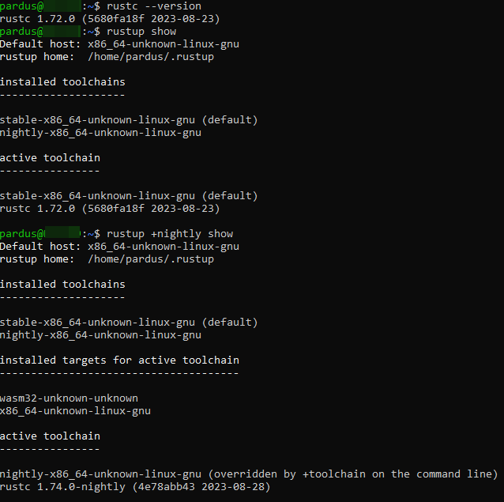
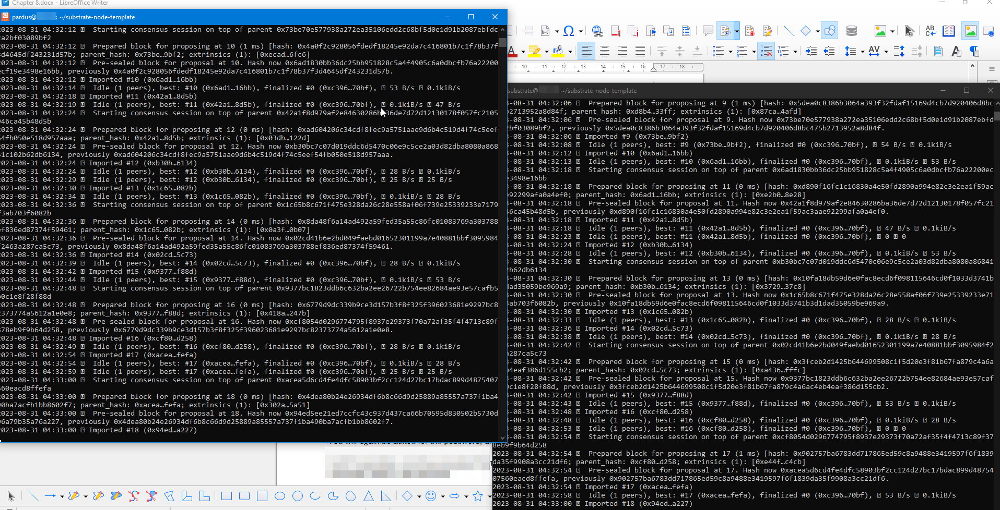
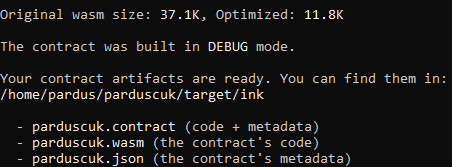
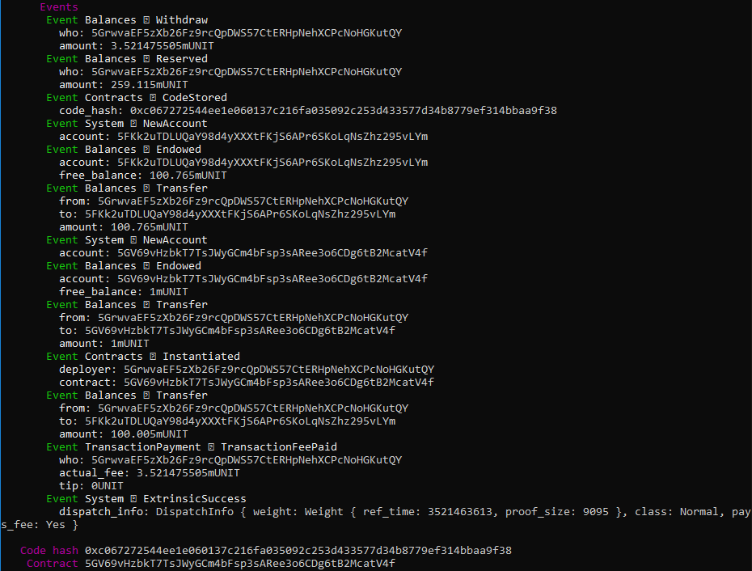
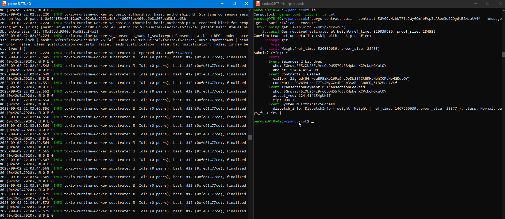
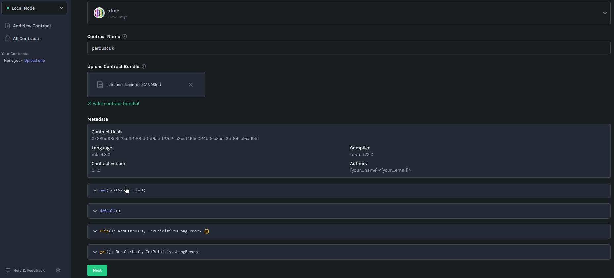
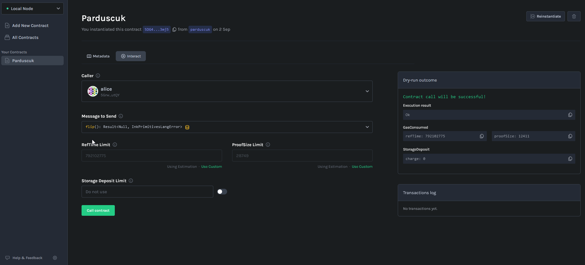

# Web3 Parduscuk Substrate Contract ink! Based Get/Flip DApp - README

Welcome to the **Web3 Parduscuk DApp** project repository! ink! is a programming language for smart contracts; blockchains built with the Substrate framework can choose from a number of smart contract languages which one(s) they want to support. ink! is one of them. It is an opinionated language that we have built by extending the popular Rust programming language with functionality needed to make it smart contract compatible.

## Table of Contents

- [Overview](#overview)
- [Features](#features)
- [Getting Started](#getting-started)
  - [Prerequisites](#prerequisites)
  - [Installation](#installation)
- [Usage](#usage)
- [Smart Contracts](#smart-contracts)
- [Testing](#testing)
- [Frontend](#frontend)
- [Contributing](#contributing)
- [License](#license)

## Overview

The **Web3 Parduscuk DApp** provides a user-friendly interface to participate in ink!-based application. ink! is an Embedded Domain Specific Language (EDSL) that you can use to write WebAssembly based smart contracts in the Rust programming language.

ink! is just standard Rust in a well defined "contract format" with specialized `#[ink(…)]` attribute macros. These attribute macros tell ink! what the different parts of your Rust smart contract represent, and ultimately allow ink! to do all the magic needed to create Substrate compatible Wasm bytecode!

## Features

- "Parduscuk" is the simplest "smart" contract you can run.

- The Parduscuk contract is nothing more than a bool which gets flipped from true to false through the `flip()` function.

## Getting Started

Follow these steps to set up the project locally and start participating in Web3 flipping.

### Prerequisites

1. Node.js: Ensure Node.js is installed. Download it from [nodejs.org](https://nodejs.org/).
2. Rust Toolchain: Ensure Rust Toolchain is installed. Check it from [Rustup](https://sh.rustup.rs).
3. Substrate Node Template: Ensure Substrate Node Template is installed. Check it from [Substrate Node Template](https://github.com/substrate-developer-hub/substrate-node-template).
4. Yarn: Ensure Yarn is installed.
5. Substrate Front End Template: Ensure Substrate Front End Template is installed. Check it from [Substrate Front End Template](https://github.com/substrate-developer-hub/substrate-front-end-template).
6. Rust-SRC: Ensure rust-src is installed.
7. Web-Assembly: Ensure wasm32 is installed.
8. Cargo-Contract: Ensure cargo contract is installed.
9. Contracts Node:Ensure substrate-contracts-node is installed. Check it from [Contracts-Node](https://github.com/paritytech/substrate-contracts-node.git).

### Installation

## Usage

## Smart Contracts

## Testing

## Frontend

## Contributing

Contributions to this project are welcome! To contribute:

1. Fork the repository.
2. Create a new branch for your feature/bug fix.
3. Make changes and test thoroughly.
4. Commit with clear and concise messages.
5. Push changes to your fork.
6. Submit a pull request describing your changes.

## License

This project is licensed under the [MIT License](LICENSE).

---

Thank you for your interest in the Web3 Parduscuk project! For questions or suggestions, reach out to us.

Enjoy on the blockchain! 🚀
